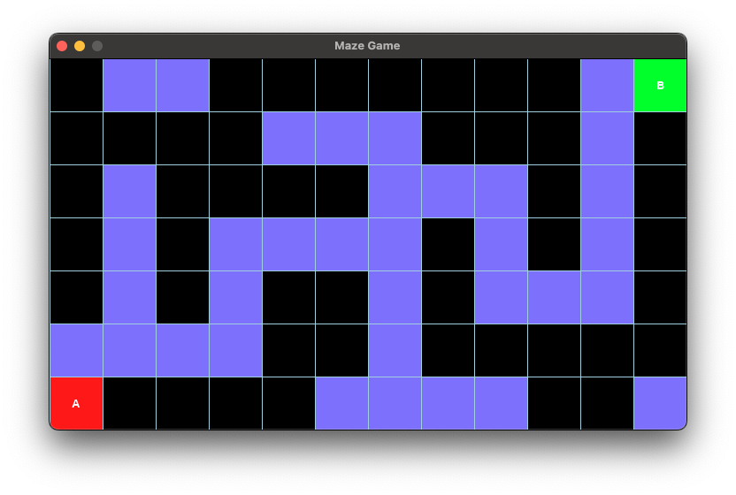

# Maze Game

This starter code shows a grid-based maze.

- The grid consists of multiple squares.
- **Black square**: obstacles or walls
- **Light blue squere**: unexplored areas
- **A**: starting point
- **B**: destination



## Project Files

```
    ├── colors.py
    ├── constants.py
    ├── main.py
    ├── maze.png
    ├── maze_data.py
    └── readme.md
```

- **colors.py**: defines color constants
- **constants.py**: defines other constants like layout dimensions
- **maze_data.py**: contains map data for this maze
    - **1**: wall
    - **0**: unexplored area
    - **START_POSITION**: tuple contains the (x,y) for starting point
    - **END_POSITION**: tuple contains the (x,y) for ending point
- **main.py**: the main python file

## How to run:

Depending on your python installation, the Python command could be `python`, `pip` or `python3` and `pip3`


- Install `pygame` if haven't
```
    pip3 install pygame
```

- Run maze
```
    python3 main.py
```

### Tasks

1. Run the game on your computer. 
2. Make the font (for the label 'A' and 'B') bigger
3. Create a different maze map (changing maze_data.py)

#### Bonus Task

The starter code displays a 7 x 12 maze.

Create a new maze with dimension of 8 x 15
